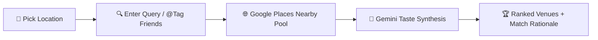

<div align="center">

# 🍽️ TableUs
### *The Location-Aware AI Group Dining Planner*

[](https://cursor.com)
[](https://deepmind.google/technologies/gemini/)
[](https://nextjs.org/)
[](https://fastapi.tiangolo.com/)
[](https://developers.google.com/maps)

<br />

**TableUs solves the endless group chat debate of *"Where should we eat?"***

By fusing **real-time Google Maps geocoding**, **Google Places candidate pools**, and **Google Gemini multi-person taste synthesis**, TableUs transforms complex group preferences into ranked, explainable restaurant recommendations in seconds.

[Explore Features](#-core-product-experience) • [Main Workflow](#-main-planning-flow) • [Tech Stack](#-technology-stack) • [Quick Start](#-quick-start)

<br />


</div>

---
 
## ⚡ What TableUs Focuses On

- **🎯 Small-Group Meal Planning**: Rapid decision-making for 1-5 people without long-term social network bloat.
- **📍 Grounded Location Intelligence**: Dynamic nearby restaurant discovery rooted in live Google Geocoding & Places APIs.
- **🤖 Explainable AI Reasoning**: Transparent match percentages and natural-language justifications for every venue.
- **👥 Multi-Person Taste Synthesis**: `@` tag friends to instantly merge distinct dietary needs, budget constraints, and craving profiles.
- **📷 Multimodal Taste Learning**: Submit natural language reviews or food photos to continuously evolve user preference models via Gemini Vision.
- **🚀 Zero-Database Setup**: Instant in-memory demo dataset designed for frictionless local testing and prototyping.

---

## 🌐 Core Product Experience

### 1. 3D Spatial Discovery & Location-Aware Search
Set your target location or resolve current coordinates to fetch a real-time pool of nearby restaurants from Google Places. Search using natural language queries like `"casual ramen near downtown with outdoor seating"` or `"romantic quiet Italian spot"`.


---

### 2. Multi-Person Group Consensus Engine
Planning dinner with friends? Tag demo connections directly in your query (e.g. `@Bob Martinez @Carol Washington`) or combine notes on the social hub. TableUs merges all participant preference summaries to rank venues by joint satisfaction.


---

### 3. Deep Match Rationale & Restaurant Briefs
Click on any candidate card to open the AI Brief Modal. View match percentages, walking distance, price tier, detailed reasoning based on group preferences, and direct Google Maps navigation.


---

### 4. Multimodal Reviews & Taste Profile Evolution
Keep dining preferences fresh without tedious forms. Upload dish photos processed by **Gemini Vision** or write casual reviews. The AI extracts taste notes, dietary restrictions, and venue preferences to automatically update stored profiles.

<div align="center">

| 📝 Natural Language Review & Photo Analysis | 👤 Adaptive Taste Profile Summary |
|---|---|
|  |  |

</div>

---

## 🔄 Main Planning Flow



1. **Select Demo User**: Choose a starting profile from the sidebar.
2. **Set Location**: Search any city or landmark to center the search pool via Google Maps Geocoding.
3. **Natural-Language Query**: Type cravings, atmosphere, or price constraints into the search field.
4. **Group Integration**: Optionally `@` tag friends to include their taste profiles in the recommendation engine.
5. **Review AI Briefs**: Inspect match percentages, dietary compatibility, and concise reasoning for each option.
6. **Submit & Evolve**: Share reviews or dish photos to continuously refine personal taste models.

---

## 🛠️ Technology Stack

| Layer | Technology | Key Function |
|---|---|---|
| **Frontend** | Next.js 16, React 19, Tailwind CSS 4, Framer Motion | Modern responsive UI, 3D Orbit visualizations, fluid animations |
| **Backend** | FastAPI, Python 3.10+ | Lightweight REST API, prompt orchestration, in-memory state management |
| **AI Engine** | Google Gemini 2.5 / 2.0 Flash | Multimodal vision, multi-person preference synthesis, explainable ranking |
| **Location Services** | Google Maps Geocoding & Places APIs | Real-world coordinate resolution and live venue candidate retrieval |

---

## 📂 Repository Structure

```text
Tableus-ai-agent/
├── frontend/             # Next.js 16 application
│   ├── app/              # App router pages (/discover, /friends, /review, /profile)
│   ├── components/       # UI components (Orbit, Candidate Cards, Brief Modals)
│   └── lib/              # API client and client state helpers
├── backend/              # FastAPI server
│   ├── main.py           # Endpoint definitions & Gemini prompt pipelines
│   ├── google_maps_service.py # Maps API wrapper & fallback geocoders
│   └── data.py           # Demo user profiles, reviews & preference datasets
├── docs/                 # Documentation assets & product banners
│   ├── images/           # Formatted product mockups
│   └── screenshots/      # Raw application captures
└── generate_product_banners.py # Banner generation utility
```

### Main Application Routes

- `/discover` — Location-aware spatial search & 3D venue ranking
- `/friends` — Demo social connections, preference overlap, and group setup
- `/review` — Multimodal review submission & Gemini Vision dish analysis
- `/profile` — Personal taste profile summary and dietary preferences

---

## 🚀 Quick Start

### Prerequisites
- Node.js 18+ and `npm`
- Python 3.9+ (Python 3.10+ recommended)
- Google Gemini API Key and Google Maps API Key

### 1. Clone the Repository
```bash
git clone https://github.com/samkwak/Tableus-ai-agent.git
cd Tableus-ai-agent
```

### 2. Set Up Backend
```bash
cd backend
python3 -m venv .venv
source .venv/bin/activate
pip install -r requirements.txt
```

Create a `backend/.env` file with your credentials:
```env
GEMINI_API_KEY=your_gemini_api_key
GOOGLE_MAPS_API_KEY=your_google_maps_api_key
```

Run the backend server:
```bash
uvicorn main:app --host 127.0.0.1 --port 8000 --reload
```

### 3. Set Up Frontend
In a separate terminal window:
```bash
cd frontend
npm install
npm run dev
```

Open [http://localhost:3000](http://localhost:3000) in your browser to experience TableUs.

---

<div align="center">

**Built for Cursor Hackathon 2026 🏆 2nd Place Winner**  
*Empowering small groups to spend less time deciding and more time dining.*

</div>
